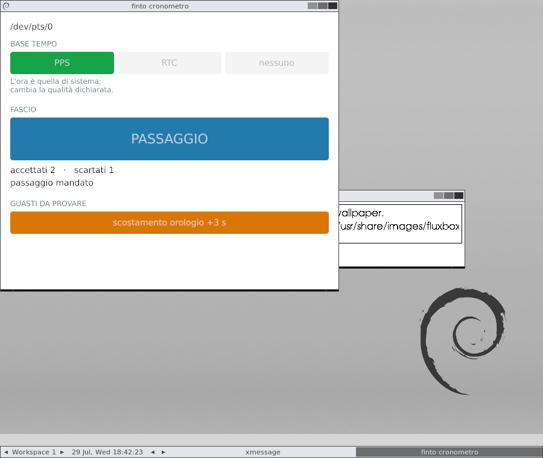

# finto-cronometro

Un cronometro Arduino **simulato** su una pseudo-seriale, con una paginetta per
comandarlo. Serve a provare brrm senza hardware: una gara intera — passaggi,
diagnostica, degrado del tempo, avvisi di riallineamento — senza un Arduino, un
GPS e un cavo.

Il caso che serviva di più è l'ultimo: gli stati che sul campo non si sanno
riprodurre a comando. Perdere il fix a metà manche, o far riallineare l'orologio
del device, qui è un clic.

## Uso

```
go build -o finto-cronometro .
./finto-cronometro
```

```
pseudo-seriale: /dev/ttys004
pannello:       http://127.0.0.1:8099
```

Si comanda **da tastiera**, nello stesso terminale: Invio manda un passaggio,
`g`/`r`/`n` cambiano la base tempo, `w` manda l'avviso di scostamento, `?` l'aiuto.
È la via principale perché il terminale è già aperto, non c'è una finestra da
cercare fra le altre, e funziona attraverso ssh — che è come si prova un nodo su un
Raspberry.

In brrm: **Avanzate → Trasporti → porta seriale** = quel percorso. Il rilevamento
delle porte lo riconosce da sé, perché risponde al `#` come il firmware vero — e
si dichiara `2-sim`, così in un log di gara si vede a colpo d'occhio che quei
tempi non vengono da un cronometro.

## Le tre interfacce

| | come | quando |
|---|---|---|
| **tastiera** | il terminale da cui è partito | il caso normale, e via ssh |
| **pannello web** | `http://127.0.0.1:8099` | pulsante grosso, o comandarlo da un telefono |
| **finestra nativa** | `-tags gui` in build, poi `-finestra` | quando si vuole una finestra e non una scheda |

La finestra nativa è **dietro un tag di build** perché Gio porta ventidue moduli,
ottanta pacchetti e richiede cgo — su Linux anche gli header di X11 o Wayland — e
il binario passa da 8 a 14 MB:

```
go build -o finto-cronometro .                 # tastiera + pannello (8 MB)
go build -tags gui -o finto-cronometro-gui .   # anche la finestra (14 MB)
./finto-cronometro-gui -finestra
```

**Verificata in un container Linux**, con lo stesso trucco che il legacy usa per
Qt6 — Xvfb dentro il container, x11vnc per guardarlo da Screen Sharing:

```
./dev/vnc.sh            # avvia e apre Screen Sharing (vnc://localhost:5902, password brrm-dev)
./dev/vnc.sh --scatto   # cattura ./finestra.png ed esce
```



Nello scatto: tre clic su PASSAGGIO, di cui uno entro il secondo — «accettati 2 ·
scartati 1», e il pannello web concorda (`{"passaggi":2,"scartati":1}`). Le due
interfacce non possono divergere perché nessuna tiene una copia dei contatori: Gio è
immediate-mode e ridisegna leggendo lo stato vero.

> **Su macOS serve una sessione grafica vera.** Lanciata da un terminale che non ha
> accesso al window server, Gio va in panico creando la finestra
> (`runtime/cgo: misuse of an invalid Handle`) — e non è un difetto di questo codice:
> un hello-world Gio nudo fa lo stesso, con Gio 0.8 e 0.10 e con Go 1.25 e 1.26. Dal
> desktop dovrebbe funzionare; nel container funziona, ed è quello che i controlli
> usano.

Non Wails: quello incorpora un motore di browser (WebView2, WebKit). Non
toglierebbe il browser, lo nasconderebbe, e aggiungerebbe npm e la sua CLI alla
build per mostrare la stessa pagina che già c'è.


## Cosa si comanda

**Base tempo** — `PPS` (GPS agganciato), `RTC` (holdover), `nessun tempo`. L'ora è
**sempre** quella di sistema: cambia la *qualità dichiarata*, che è quella con cui
brrm decide quanto fidarsi del tempo. Con «nessun tempo» il passaggio non viene
nemmeno mandato, esattamente come fa il firmware — il fascio è stato interrotto e
nessuno lo sa, che è il guasto da poter provare.

**Passaggio** — un clic, o la barra spaziatrice. Antirimbalzo di 1 secondo
retriggerabile come nel firmware: due colpi ravvicinati contano come uno, e il
pannello dice quando ne ha inghiottito uno invece di far sembrare che il pulsante
non funzioni.

**Scostamento** — manda il `W` di riallineamento dell'orologio. In brrm compare
come banda nella schermata di gara, con lo scarto in secondi.

## Cos'è e cosa non è

È un modello del **comportamento sul filo**, non del firmware: non simula il PPS,
i tick del timer, l'NMEA. Sul filo parla il protocollo di
`arduino/cronometro_gps` — `P`, `K`, `Y`, `D`, `W` e i comandi `?`, `@`, `#` — e
quello è tutto ciò che brrm vede.

La diagnostica manda i **sedici campi posizionali** nell'ordine del firmware, con
valori coerenti fra loro: con il GPS agganciato il fix è `A` e i satelliti ci
sono, in holdover il fix è `V` e i secondi dall'ultimo PPS crescono. Una
diagnostica che mostrasse nove satelliti senza fix insegnerebbe a non fidarsi di
quella schermata.

## Dipendenze e portabilità

Nessuna dipendenza: la pseudo-seriale si crea con tre `ioctl` sulla libreria
standard, e la pagina è un file solo senza build.

**macOS e Linux.** Su Windows una COM virtuale richiede un driver in kernel
(com0com o simili) e non si può creare da un programma: lì la strada è installare
com0com, che crea una coppia COM4↔COM5, e far aprire a questo simulatore un capo
e a brrm l'altro.

## Test

```
go test ./...
```

I test fissano la **fedeltà al protocollo**, che è la cosa che questo programma
deve non sbagliare: i millesimi a tre cifre (col parser di brrm «.5» sarebbe 5 ms
e non 500), l'antirimbalzo retriggerabile, il silenzio senza base tempo, i sedici
campi coerenti, e il formato del `W`.
